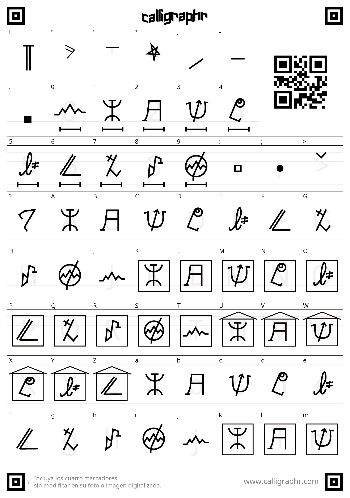
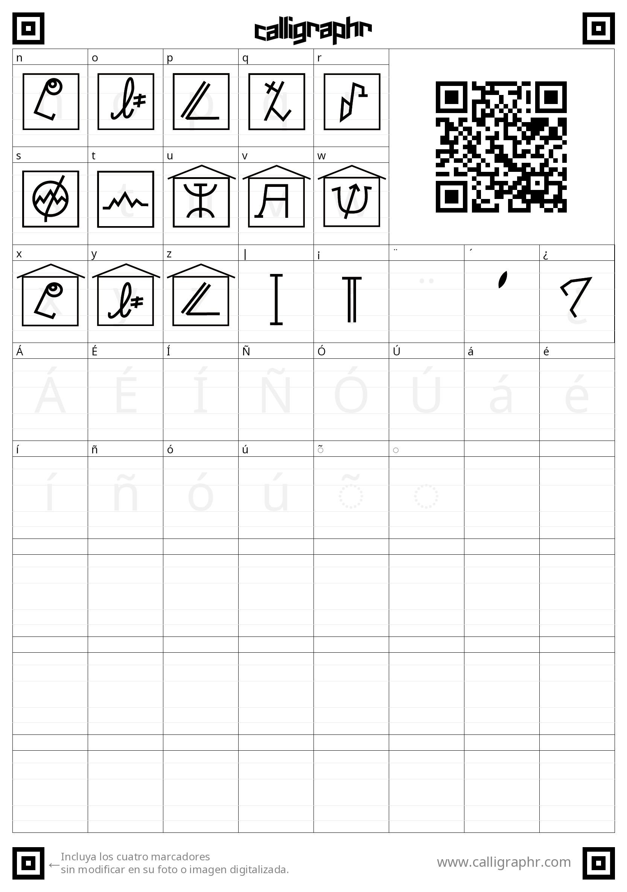

<h1> DISEÑO DEL LENGUAJE: KRAVNIKA </h1>
<h2>ALFABETO<h2>
Para todo caracter "c", es valido dentro del lenguaje KRAVNIKA, si y solo si pertenece a:

* Letras = {x | x sea una letra del alfabeto latino con traducción al KRAVNIKA}
* Simbolos = {", ', *, ,, -, ., :, ;, >, |, !, ?}
* Digitos = {x | x sea un digito del sistema decimal con traducción al KRAVNIKA}

Cada simbolo, letra y digito mencionado anteriormente, tiene una traducción directa al KRAVNIKA, seguir la siguiente guia:

<h2>REGLAS</h2>
En Kravnika, una cadena es valida, solo si se cumplen las siguientes reglas:
(Nota: Cada simbolo utilizado en las reglas proviniente del alfabeto latino, debe ser utilizado con su respectiva traducción al KRAVNIKa)

* Cada oración en KRAVNIKA deben de terminar un ".".

* Cada palabra en una oración, debe de ser separada por ":", los espacios son indiferentes en el lenguaje y se recomienda su desutilización.

* Cada palabra, luego de la primera letra, deberá de contener obligatoriamente " o ', cada una actuando como inicial mayúscula. La elección se deja a la comodidad.

* Las oraciones no pueden contener los nombres: Jorge, Jonathan, Fabritzio o Rodrigo. La cadena no es valida incluso si se intenta evitar con simbolos o números (Ej. J!or98g82e).

* Los signos de exclamación e interrogación son validos, incluso pueden ser combinados en la misma oración e ir incrustados entre palabras, siempre y cuando se consiga cerrar con el mismo simbolo en la misma oración.

* El sistema de numeración en KRAVNIKA es decimal, variando unicamente en el valor relativo de las cifras. Las unidades pueden ser escritas con los simbolos de los números del 0-9; Los siguientes solo pueden ser seguidos de digitos entre 1-9, las decenas deben de ser precedidas por "||"; Las centenas por "|;"; Y los millares por "|>;". Actualmente el lenguaje solo permite escribir hasta el número 9999. Si se escribe un valor posicional mayor al número que anteriormente habiamos escrito, este se considerará como un número aparte dentro de la misma palabra (Ej: ||1|>;5 se consideran un 100 y un 5000 por aparte).